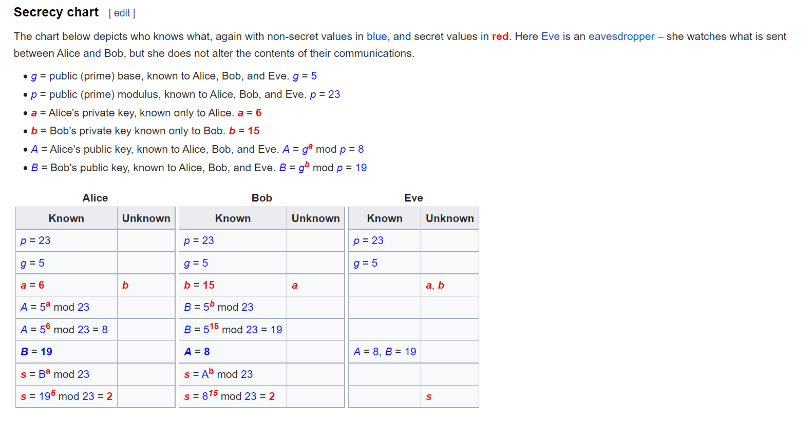

# Diffie's key exchange 1
27 solves

<https://github.com/IRS-Cybersec/Sieberrsec-CTF-3.0/tree/master/Crypto/diffies_key_exchange>

## Description 

Diffie created a new key exchange system to help securely transfer private keys in a public channel. Can you see whats wrong with his system?

Connect here: nc challs.sieberrsec.tech 1337

[chall.py](https://github.com/IRS-Cybersec/Sieberrsec-CTF-3.0/blob/master/Crypto/diffies_key_exchange/bin/chall.py)

Author: noyou

## Solution 

"Diffie" is a significant clue to the encryption scheme. 

Searching Diffie key exchange will return results on [Diffie-Hellman key exchange](https://en.wikipedia.org/wiki/Diffie%E2%80%93Hellman_key_exchange).



Let's look at the code first. 

```python
import os
import random
from Crypto.Util.number import bytes_to_long, getPrime

iv = os.urandom(8)
with open('flag.txt', 'rb') as f:
    flag = bytes_to_long(f.read())

g = 5
p = getPrime(512)
a = random.randrange(2, p - 1)
A = pow(g, a, p)

print("WELCOME TO DIFFIE'S KEY EXCHANGE!!!!!\n")
print(f'g: {g}', f'p: {p}', sep='\n')

priv_key = int(input("\nWhat is your private key?\n"))
B = pow(g, priv_key, p)
shared_secret = pow(B, a, p)
enc = flag * shared_secret

print(f'\nencrypted flag: {enc}')
exit()
```

In this scenario, we take on the role of the second individual, or `Bob`. We can control the private key, or `b`. 

Hence, 
- `g` is constant
- `p` is random and known
- `a` is unknown (randomly generated)
- `A` is unknown (dependent on a, which is unknown)
- `b` is controlled 
- `B` is controlled 
- `shared_secret` is... interesting
- `enc` is known if `shared_secret` can be controlled 

The important thing to understand is the math. (this is a dumbed-down explanation. but it's so cool)

`B` is generated with function g^b mod p.
- `g` is 5
- 5 to the power of `b`(controlled) mod `p`
- mod is essentially to find the remainder
- so `B` is the remainder of (5^`b`) / `p` 

### INDICES TIME 
4TH RULE OF INDICES <br>
anything to the power of 0 is 1

when `b` = 0, <br>
`B` = 1 mod `p` <br>
1 mod anything is 1 because 1 can only be divided by itself, so `p` or `g` don't matter <br>
therefore when `b` = 0, `B` = 1

below is the formula for shared_secret 


let's focus on `B`^`a` mod `p`. 

`a` is unknown. But we can control `B`, which is 1, and 1 to the power of anything is 1. <br>
so, `a` doesn't matter, <br>
and from previously, `p` doesn't matter either. <br>
When `b` = 0, `shared_secret` = 1

since enc = shared_secret * flag <br>
when shared_secret = 1 <br>
enc = 1 * flag <br>
enc = flag 


from the code, the flag was encrypted with `bytes_to_long()`. So we just reverse that. 


IRS{d1ff1e_h311m4n!!!}
