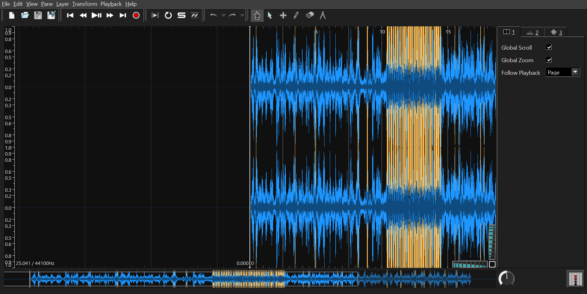
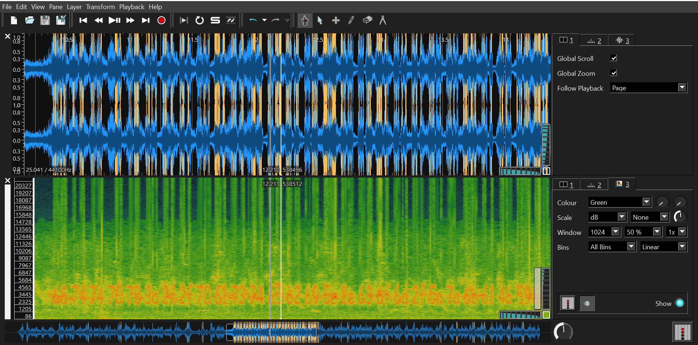
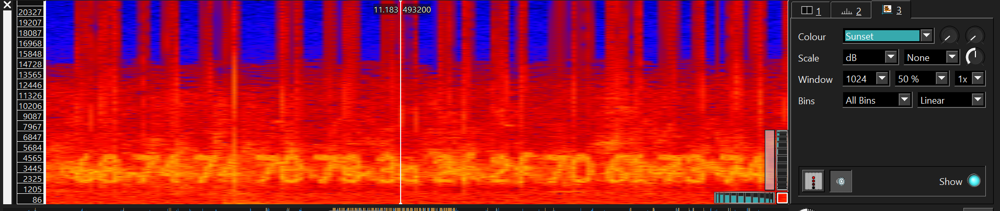
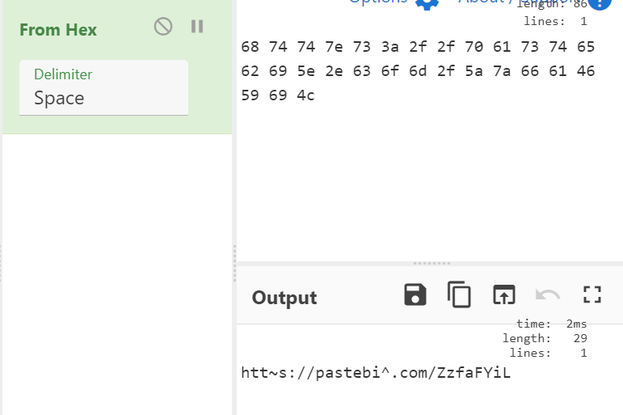
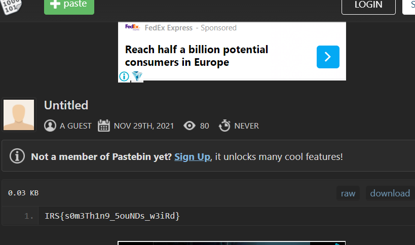

# Birds?
https://github.com/IRS-Cybersec/Sieberrsec-CTF-3.0/tree/master/Forensics/Birds

30 Solves

## Description
I can't help but feel that the birds are trying to tell me something...

[suspiciousbirds.mp3](https://github.com/IRS-Cybersec/Sieberrsec-CTF-3.0/blob/master/Forensics/Birds/suspiciousbirds.mp3)

## Solution
LOL mp3 file,, as someone who watches game theory and minecraft easter eggs I immediately know it has to do with converting the audio to an image based on the frequencies. At the time I forgot what the software was called, but it's called a spectrogram. For some reason my brain kept thinking it was similar to "steganography" or "stenography" but "spectrogram" does not contain the letter n at all. This mental mix-up did not help my frantic googling looking for a spectrogram. How can you find something when you don't even know what it's called. 

Good thing I found the word, and after googling "ctf spectrogram", I downloaded one of the first programs I saw, which was <https://www.sonicvisualiser.org/>. I think most people use audacity, which I think comes preinstalled on windows. However, you may need to change the viewable frequencies on audacity. 

Opening sonic visualizer and opening the file, that yellow part seems suspicious

Zooming in doesn't reveal anything because silly me forgot to actually add a spectrograph under `pane > add spectogram`

After that we can see some funny characters

I decided to change the colours to make things (hopefully) a bit more readable

Typing out the characters into cyberchef nicely detects a hex string 

maybe not as nice as I thought. But it's evidently a pastebin link, which we can easily mend when entering the url. 

(okay, yes. I may have misread 6b as 66. it's not easy to tell okay. Anyway)

the correct url is <https://pastebin.com/ZzkaFYiL>

`IRS{s0m3Th1n9_5ouNDs_w3iRd}`

## Comments 

The low readability of characters in a spectogram is something to watch out for when creating/solving future spectogram challenges. 
