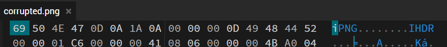
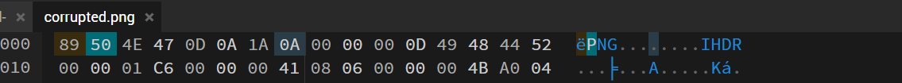
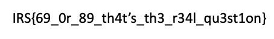

# Hexed It! (unreleased)

https://github.com/IRS-Cybersec/Sieberrsec-CTF-3.0/tree/master/Forensics/Hexed_It

[corrupted.png](https://github.com/IRS-Cybersec/Sieberrsec-CTF-3.0/blob/master/Forensics/Hexed_It/corrupted.png)

## Solution 

this chall q dumb ah 

- Open the file in a hexeditor 
- observe that the first magic byte is wrong

- change 69 to 89 (proper magic byte)

- save file and view file 
 

 
- shake head at chall creator's bad sense of humour  
