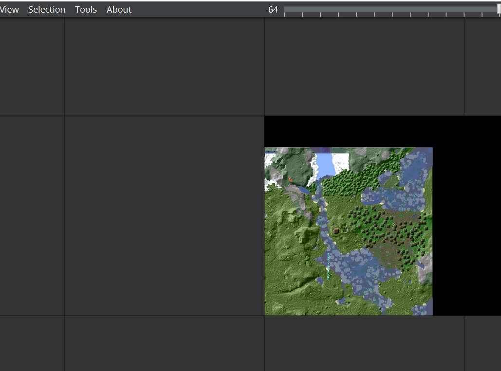
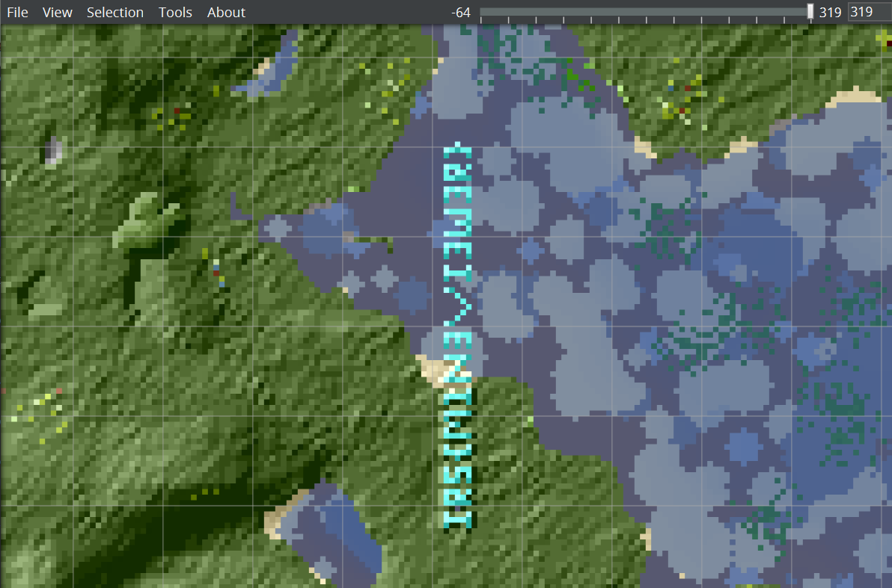

# Mind Cracking Adversity 
https://github.com/IRS-Cybersec/Sieberrsec-CTF-3.0/tree/master/Forensics/Mind_cracking_adversity

4 Solves

## Description

My thumbdrive got corrupted and all I have left of my /saves folder is this [world](https://github.com/IRS-Cybersec/Sieberrsec-CTF-3.0/blob/master/Forensics/Mind_cracking_adversity/flagworld.zip) here...

Help me find out what I built inside!

Note: If you are unable to see the words clearly, open a ticket and show a proof that you found it.

Author: xzy_10

## Solution

I was unable to solve this challenge during the ctf. 

The file provided is a zip file containing files in the `.mca` format. One `.mca` file is one saved minecraft chunk. 

One minecraft chunk is 16x16 blocks. 

The idea is to get some world/chunk viewer that will load the chunks so you can view them. There are various tools you can use, but the tricky part is finding one that will cooperate with you. 

minecraft more like minepain I've tried so many ive tried mcedit ive tried overworld viewer ive tried obscure webpages ive downloaded weird programs off the internet

anyway you're here to find what works so MCA Selector is what works <https://github.com/Querz/mcaselector>

After downloading the .exe, you need to go into properties to allow windows to run the program. It will properly install the program and after it starts up, you can go to the top right and `File > Open World > [select unzipped flagworld]`.

Use the middle click to click and drag, and the scroll wheel to zoom in/out. If you go a little to the right and down, and zoom in, you will see some blue blocks(diamond?) on the overworld floor. 

It becomes a matter of zooming in and using eye power.

`IRS{M1N3VI3W3R}`

## Comments

I actually watched a video on mca selector by pixlriffs. and I decided not to try it because of the editing functions and i didnt want the editing functions. like i was just convinced that there was one simple world viewer program out there and I didnt need to load this atas program to delete chunks or whatever I just wanted to view the mca files I'm insane man 

