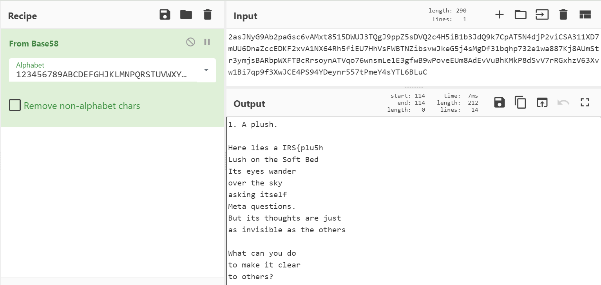
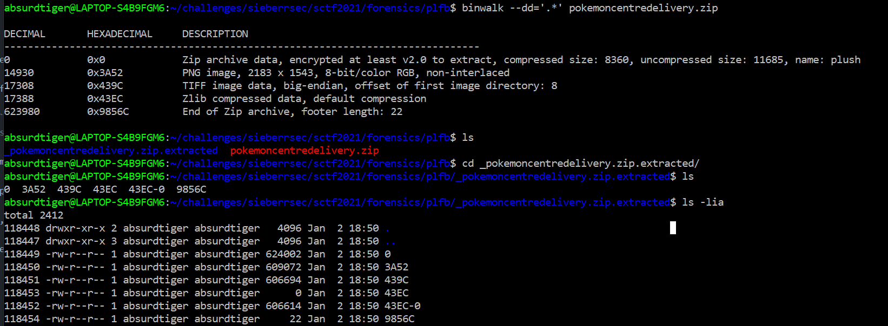
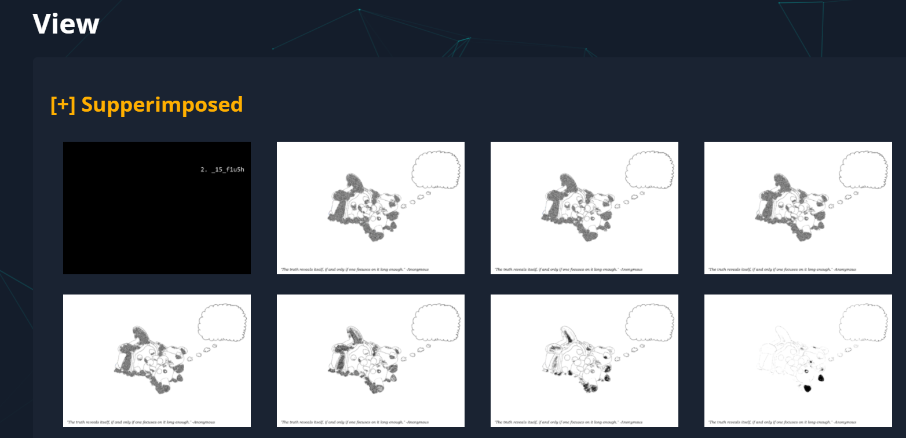
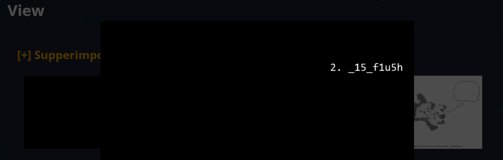
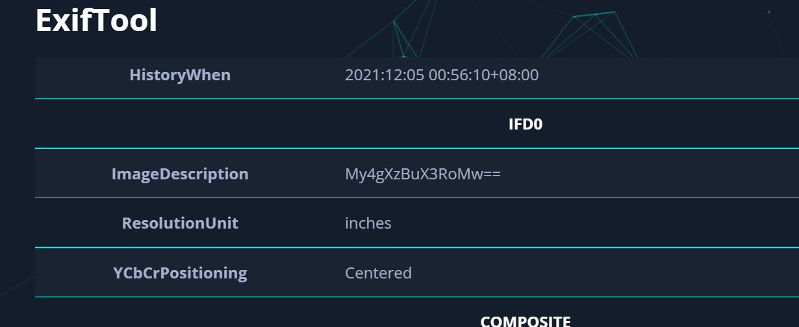
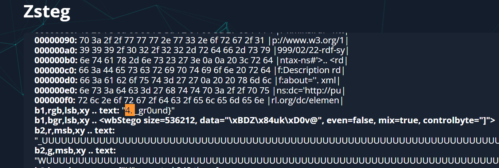

# Plush, Lush, Flush, Blush
https://github.com/IRS-Cybersec/Sieberrsec-CTF-3.0/tree/master/Forensics/plush_lush_flush_blush
7 solves

## Description

ok so there's this plush that i really want from pokemon centre but there's no more physical stock left. :(

so, i had it delivered in paper mario style instead!

[can you find the hidden message?](https://github.com/IRS-Cybersec/Sieberrsec-CTF-3.0/blob/master/Forensics/plush_lush_flush_blush/pokemoncentredelivery.zip)

## Solution

We did not originally solve this.

There are 4 parts to the challenge. 

I found the first part by running `strings` on the file:

```START{2asJNyG9Ab2paGsc6vAMxt8515DWUJ3TQgJ9ppZ5sDVQ2c4H5iB1b3JdQ9k7CpAT5N4djP2viCSA311XD7mUU6DnaZccEDKF2xvA1NX64Rh5fiEU7HhVsFWBTNZibsvwJkeG5j4sMgDf31bqhp732e1wa887Kj8AUmStr3ymjsBARbpWXFTBcRrsoynATVqo76wnsmLe1E3gfwB9wPoveEUm8AdEvVuBhKMkP8dSvV7rRGxhzV63Xvw1Bi7qp9f3XwJCE4PS94YDeynr557tPmeY4sYTL6BLuC}END ```

Dumping the string into cyberchef returns:



So, the first part: `IRS{plu5h`.

Thereafter, running `binwalk --dd='.*' filename` will extract all the identified files. 



There's this steg website <https://aperisolve.fr/> that is very good for parsing image files. 

Downloading the detected PNG file and running it through aperisolve, 





Second part! `_15_f1u5h`

Scrolling a little bit more, we can find:



`My4gXzBuX3RoMw==` through base64 returns `3. _0n_th3`

Third part `_0n_th3`

The last part is hidden in the least significant bit, which also can be seen in aperisolve:



 `_gr0und}`
 
 Combining all the parts together, we get `IRS{plu5h_15_f1u5h_0n_th3_gr0und}`
