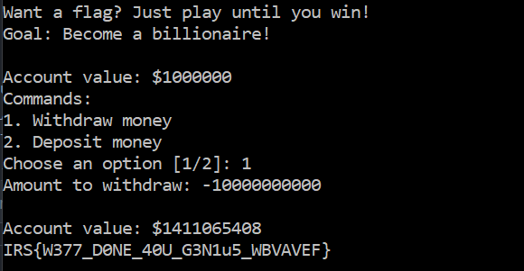
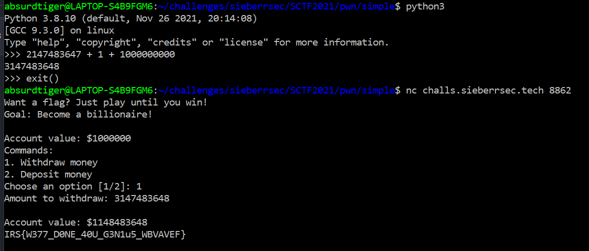
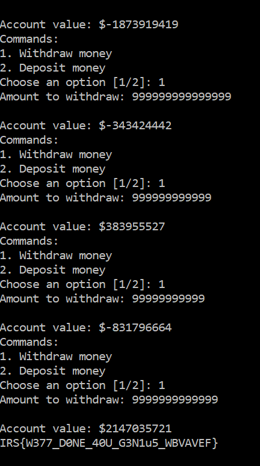

# simple
47 solves

https://github.com/IRS-Cybersec/Sieberrsec-CTF-3.0/tree/master/Pwn/simple

## description
Simple game right?

`nc challs.sieberrsec.tech 8862`

```c
#include <stdio.h>
#include <stdlib.h>

// cc simple.c -o simple -fstack-protector-all
int main(void)
{
	puts("Want a flag? Just play until you win!");
	puts("Goal: Become a billionaire!");
	int account_value = 1000000;
	while (account_value < 1000000000) {
		printf("\nAccount value: $%d\n", account_value);
		puts("Commands:");
		puts("1. Withdraw money");
		puts("2. Deposit money");
		printf("Choose an option [1/2]: ");
		int option = 0;
		scanf("%d", &option);
		while (option != 1 && option != 2) {
			puts("Invalid option!");
			printf("Choose an option [1/2]: ");
			scanf("%d", &option);
		}
		if (option == 1) {
			printf("Amount to withdraw: ");
			int withdrawal = 0;
			scanf("%d", &withdrawal);
			account_value -= withdrawal;
		} else {
			puts("LOL no you are not allowed to deposit money. :(");
		}
	}
	printf("\nAccount value: $%d\n", account_value);
	system("cat flag");
	return 0;
}
```

## solution
this one was weird. lol. 

as someone who doesn't understand c, I hoped that the low relative points and high number of solves meant that I could wing it. 

sending any non-numerical character made the program crash. <br>
the next reasonable thing is to spam a reaaaally high number. 

my original solve was sending a bunch of 9s, seeing the bank bal go up by one, sending again, seeding it go up by one more, sending again with fewer, seeing a negative value, freaking out and spamming more than previously and thankfully the flag appeared. 

after actually reading the source code and reading about BE and talking to people, here's what I think is happening.

### solution 1: unsigned integers
the input being recieved is declared at `int withdrawal = 0;` <br> 
the program also runs `account_value -= withdrawal;`<br>

basic math:
- 1 - (-1) = 2



### solution 2: integer overflow
<https://www.acunetix.com/blog/web-security-zone/what-is-integer-overflow/>
> Results can be even more unexpected for signed integers. When you go above the maximum value of the signed integer, the result usually becomes a negative number. For example, 2,147,483,647 +1 is usually −2,147,483,648. When you go below the minimum value (underflow), the result usually becomes a positive number. For example, −2,147,483,648 − 1 is usually 2,147,483,647.
this effectively means that if you input the right number, the number will turn into a negative number.

then the concept in solution 1 applies.



### solution 3: whatever the heck I did
spamming 9s



`IRS{W377_D0NE_40U_G3N1u5_WBVAVEF}`
