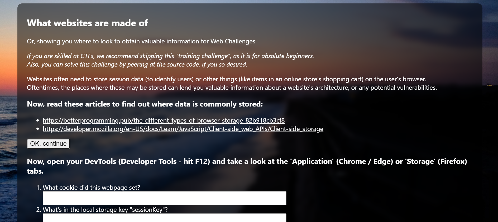
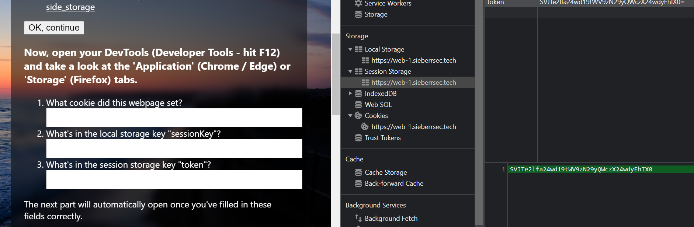

# Super Basic Introduction to Web Storage
category: web | practice chall | author: theoleecj

## Description
***If you are skilled at CTFs, we recommend skipping this "training challenge", as it is for absolute beginners.***

Websites often need to store session data (to identify users) or other things (like items in an online store's shopping cart) on the user's browser. Oftentimes, the places where these may be stored can lend you valuable information about a website's architecture, or any potential vulnerabilities.

***This challenge should not require you to install any programs onto your computer.***

Play at https://web-1.sieberrsec.tech/!

## Solution
absolute beginner, sounds like me 

except that I didn't read the articles 

and I hit `CTRL + SHIFT + I` instead of `F12`

so this is kind of funny in that I put the cookie name and token names into the fields at first, and nothing happened but I knew the 'garbled string' was base64 already because padding so I actually got the flag before properly finding the cookie value and respective token values to put into the fields :D

then I thought that there was something wrong with the chall but I figured it out so. yay me. yay hubris salvage. 

`SVJTe2lfa24wd19tWV9zN29yQWczX24wdyEhIX0=`
base64 decoded is 
`IRS{i_kn0w_mY_s7orAg3_n0w!!!}`
